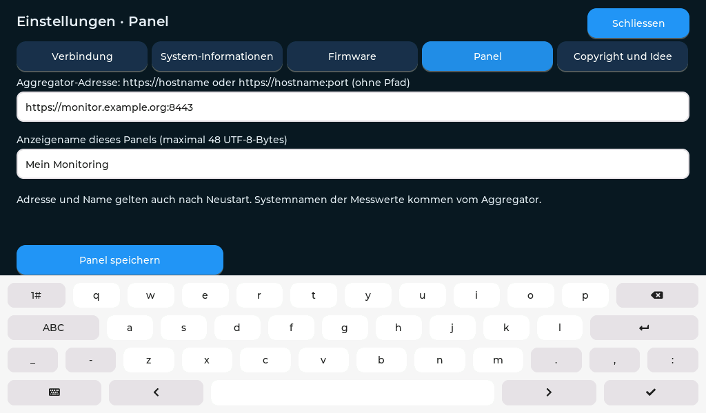
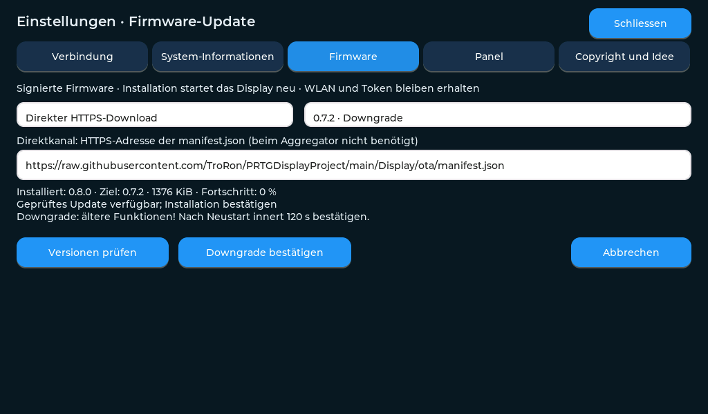

# Display einrichten

[USB-Paket 1.0.2](releases/prtg-display-1.0.2.zip) · [Anzeige einrichten](ANZEIGE.md)

## Firmware 1.0.2 – schlanke Anzeige-Erweiterung

- Einheitlich hohe Systemkarten mit vollständigem Text.
- Datenalter je System aus den PRTG-Messzeitstempeln.
- Optionaler Seitenwechsel mit Touch-/Einstellungs-/OTA-Pause.
- Optionaler softwareseitiger Nachtmodus mit Helligkeit, Stunden und manuellem UTC-Versatz.

Einrichten unter **Einstellungen → Panel → Anzeige**. Beide Automatiken sind zunächst ausgeschaltet. Favoriten, automatische Störungswechsel und Verlaufsgrafiken wurden bewusst zurückgestellt; ihre Speicher-/Hintergrundlogik ist nicht im Release enthalten.

**Update:** Versionen prüfen, **1.0.2 installieren**, nach dem Neustart innert **120 Sekunden bestätigen**. Direktkanal und Aggregator werden unterstützt. WLAN/Panel-Zugang bleiben erhalten; kein Werksreset nötig. Board Waveshare ESP32-S3-Touch-LCD-5B SKU 28151, ESP-IDF 5.5.0, bestehendes OTA-Layout unverändert. Frühere Pakete bleiben erhalten.

Modell-/LVGL-/Einstellungsprüfungen, beide PlatformIO-Profile und Hardware-Build lokal erfolgreich. Paket-Hashes und Signatur geprüft. Physischer Geräte-/Dauerlauftest von 1.0.2 steht aus.

## Aggregator 1.2.0 und Display 1.0.1

Systemverwaltung und Übersicht sind nach Infra, Backup, Docker, Netzwerk und Dienste gruppiert. Die Verwaltung zeigt aufklappbare Rubriken mit Anzahl aktiver Systeme. «System hinzufügen» übernimmt die Rubrik; «Nach oben/unten» verschiebt innerhalb dieser Rubrik. Deaktivierte Systeme bleiben ausgegraut und ausdrücklich markiert, damit sie wieder aktiviert werden können.

Änderungen gelten erst nach **Prüfen und speichern**. Die stets erreichbare Speicherleiste markiert offene Änderungen deutlich; «Verwerfen / neu laden» holt den gespeicherten Stand zurück. Die Übersicht zeigt nur gespeicherte aktive Systeme. Kategoriezuordnung und alle bisherigen Konfigurationswerte bleiben erhalten.

Display **1.0.1** übernimmt innerhalb seiner Rubriken die konfigurierte Reihenfolge. Die vorherige Firmware 1.0.0 R3 sortiert zusätzlich nach Status; für die korrekte Reihenfolge ist deshalb das Update erforderlich. Farben und Hinweise zeigen Fehler weiterhin. Deaktivierte Systeme verschwinden nach dem Speichern und dem nächsten gültigen API-Snapshot. Bei Verbindungsausfall können letzte Einträge als unbekannt sichtbar bleiben.

**Installation:** Aggregator aktualisieren; am Display unter Firmware die Versionen prüfen, **1.0.1 installieren** und nach dem Neustart innert **120 Sekunden bestätigen**. Direktkanal und Aggregator sind unterstützt. WLAN, Panel-Zugang und Einstellungen bleiben erhalten. Keine Partition-/Pinout-Änderung, kein Werksreset nötig.

Geprüft: 31 Aggregator-Tests, Desktop-/Mobilbrowser mit Gruppierung, Reihenfolge, Aktivierung, Speichern/Verwerfen und sichtbarer Speicherleiste; native LVGL- und Modelltests, beide PlatformIO-Profile, ESP-IDF-5.5.0-Hardware-Build und Paketprüfsummen. Physische Abnahme von Firmware 1.0.1 steht aus. Frühere Firmware-Releases bleiben unverändert.

[Komplette Inbetriebnahme](../docs/HANDBUCH.md) · [Bedienung / Updates / Fehlerhilfe](../docs/BETRIEB.md) · [Projektstand](../docs/PROJEKTSTATUS.md). Aggregator- und Display-Versionen sind unabhängig; Aggregator 1.1.0 erfordert keinen neuen Firmware-Build.

Diese Firmware unterstützt ausschliesslich **Waveshare ESP32-S3-Touch-LCD-5B, SKU 28151**, 1024 × 600, 16 MB Flash und 8 MB Octal-PSRAM. Aktuell ist **1.0.0 Revision 3** mit WLAN-QR-Code, Captive Portal, WLAN-Suche und WebAdmin. Lokal gebaut und getestet; die physische Abnahme der neuen Funktionen steht noch aus. 0.8.1 ist am realen Gerät bestätigt.

**[WLAN, SetupPRTGDisplay und WebAdmin einrichten](SETUP.md).** Beim Update zunächst innerhalb von 120 Sekunden «Diese Version behalten» bestätigen, danach im Register Webzugang das automatisch erzeugte zwölfstellige Zahlenpasswort ablesen. Bereits eigene Passwörter bleiben erhalten; Benutzer: `admin`.

## 1. USB-Paket herunterladen

Verwende [prtg-display-1.0.0.zip](releases/prtg-display-1.0.0.zip) und entpacke es vollständig. Alle folgenden Flash-Befehle laufen im entpackten Ordner. Einzelne Dateien nicht aus verschiedenen Releases mischen.

Enthalten sind vier getrennte Images, **kein Full-Flash-Abbild**. Das Paket enthält keine WLAN-Zugangsdaten und keine Aggregator-Adresse. Es darf keine Sicherung eines bereits eingerichteten Geräts ersetzen.

## 2. Python und Werkzeuge installieren

Python 3 installieren. Auf Windows beim Installer «Add Python to PATH» aktivieren. PowerShell beziehungsweise Terminal öffnen:

```powershell
# Windows
py -m venv .venv
.\.venv\Scripts\python.exe -m pip install esptool==4.9.0 pyserial==3.5
.\.venv\Scripts\python.exe flash.py --check
.\.venv\Scripts\python.exe flash.py
```

```bash
# macOS / Linux
python3 -m venv .venv
.venv/bin/python -m pip install esptool==4.9.0 pyserial==3.5
.venv/bin/python flash.py --check
.venv/bin/python flash.py
```

## 3. Geführt flashen

1. Panel mit einem **USB-Datenkabel** anschliessen. Seriellen Monitor und andere Programme schliessen, die den Port verwenden.
2. Der Assistent prüft die Paket-Prüfsummen und zeigt erkannte Anschlüsse. Den Anschluss des Panels auswählen, etwa `COM4` unter Windows; unter macOS den tatsächlich angezeigten `/dev/cu.usbmodem…`-Port verwenden.
3. Board und Port kontrollieren. Erst die Eingabe `FLASH` startet das Schreiben.
4. Das Werkzeug schreibt vier Images und verifiziert sie anschliessend. Kabel währenddessen eingesteckt lassen.
5. Auf die Erfolgsmeldung und die sichtbare Oberfläche warten.

Falls keine Verbindung entsteht: anderes Datenkabel/USB-Port testen; bei Bedarf BOOT gedrückt halten, RESET kurz drücken, BOOT loslassen und den Port erneut auswählen. Bei Übertragungsfehlern `flash.py --baud 115200` verwenden. Kein `erase_flash` als Routine-Schritt ausführen.

Die genauen Offsets und der manuelle Befehl stehen in [FLASH.md](releases/1.0.0/FLASH.md). Bei einem bestehenden Gerät bleiben NVS-Einstellungen erhalten, sofern es das bisherige Projektlayout verwendet. Die vier Images setzen die OTA-Auswahl zurück und starten die neue Factory-Anwendung. Von Versionen vor 0.6 ist diese USB-Installation für das neue OTA-Partitionslayout erforderlich.

## 4. Verbindung und Anzeigename eintragen

Auf dem Display die Einstellungen öffnen:

| Register | Eingabe |
|---|---|
| Verbindung | Eigenes 2,4-GHz-WLAN, Passwort, Panel-Token, erreichbarer NTP-Server |
| Panel | HTTPS-Ursprung des eigenen Aggregators, z. B. `https://monitor.example.org`; kein API-Pfad. Optional eigener Port. Anzeigename, z. B. «Serverraum». Speichern. |
| Systeminformationen | IP, Zeitsynchronisation, HTTP-Status, Datenquelle und Speicher prüfen |
| Firmware | Gewünschten Update-Kanal auswählen |
| Webzugang | WebAdmin-Passwort setzen, Browseradresse ablesen oder offline den Einrichtungshotspot starten |

Der Panelname ist unabhängig von den **Systemnamen**: Systemnamen und Sensor-Zuordnungen kommen aus der Aggregator-Konfiguration. Der PRTG-API-Key wird ausschliesslich am Aggregator hinterlegt. Das Panel benötigt den dort separat erzeugten **Panel-Token**.



Einstellungen werden lokal in NVS gespeichert und überstehen Neustarts und gewöhnliche OTA-Updates. NVS ist in diesem Build nicht verschlüsselt; ein physischer Flash-Dump ist deshalb vertraulich. Niemals solche Dumps veröffentlichen.

### Optional: Zugangsdaten über USB eingeben

Der Flash-Assistent bietet diesen Schritt direkt an. Alternativ nach dem Start der Oberfläche:

Ab **0.9.0** bietet der Flash-Assistent zusätzlich **«4 – nur WebAdmin»**. Seit 0.7.2 bestehen bereits diese Möglichkeiten: später einrichten, vollständig einrichten (WLAN/Token, Panel und optional OTA), **nur OTA-Kanal** oder **nur Panel** einrichten. Bei OTA wählst du unverändert, Aggregator oder direkt öffentlich. Im Direktkanal genügt Enter für die vorbelegte Adresse dieses Repos; eine eigene HTTPS-Manifest-URL ist ebenfalls möglich. Speichern startet weder Download noch Installation.

```powershell
# Windows: COM4 durch den eigenen Port ersetzen
.\.venv\Scripts\python.exe provision.py --port COM4
```

```bash
# macOS/Linux: Port durch den tatsächlich angezeigten Anschluss ersetzen
.venv/bin/python provision.py --port /dev/cu.usbmodemXXXX
```

WLAN-Name und NTP werden abgefragt, Passwort und Panel-Token verdeckt eingegeben. Das Werkzeug legt keine Konfigurationsdatei an. Es meldet Erfolg erst nach Speicherbestätigung. Ab 0.7.2 fragt die vollständige USB-Einrichtung auch Aggregator-Adresse und Displayname ab. Alternativ bleibt das Register Panel verfügbar. USB ist eine lokale unverschlüsselte Konfigurationsverbindung; nur am eigenen Rechner verwenden.

Nur den OTA-Kanal nachträglich ändern, ohne WLAN und Token erneut einzugeben (Firmware 0.7.1 oder neuer):

```powershell
.\.venv\Scripts\python.exe provision.py --port COM4 --ota-only
```

Unter macOS/Linux entsprechend `.venv/bin/python provision.py --port DEIN_PORT --ota-only` verwenden. Die URL und Kanalwahl bleiben nach einem Neustart erhalten. Bereits offene Einstellungen am Display danach schliessen und erneut öffnen. Ältere Firmware weist den neuen USB-Befehl zurück; das Tool meldet dafür keinen Speichererfolg.

## 5. Live-Betrieb kontrollieren

### Aggregator-Adresse und Displayname bequem über USB

Ab Firmware **0.7.2** kannst du bei bereits funktionierendem WLAN im Flash-Assistenten **«3 – nur Panel»** wählen. Ohne erneutes Flashen:

```powershell
# Windows, den eigenen Port verwenden
.\.venv\Scripts\python.exe provision.py --port COM4 --panel-only
```

```bash
# macOS/Linux, den eigenen Port verwenden
.venv/bin/python provision.py --port /dev/cu.usbmodemXXXX --panel-only
```

Das Script fragt die **Aggregator-Adresse** (z. B. `https://monitor.example.org`, ohne `/api/v1/health`) und den **Displaynamen** ab. Es bestätigt erst nach erfolgreichem Speichern. WLAN, Token und OTA bleiben dabei unverändert. Die vollständige Einrichtung fragt dieselben Angaben zusammen mit WLAN und OTA ab; Eingaben werden vor der Übertragung geprüft. Jeder Bereich wird separat gespeichert und bestätigt. Bei einem späteren Fehler bleiben bereits bestätigte Bereiche gespeichert.

Danach etwa 20 Sekunden warten. Bei erfolgreicher Datenabfrage endet die Demo automatisch. Offene Einstellungen am Display schliessen und erneut öffnen, damit sie die neuen Werte anzeigen. Ältere Firmware unterstützt diesen Befehl nicht und muss zuerst aktualisiert werden.

Erwartet werden eine IP-Adresse, synchronisierte Zeit, erfolgreicher API-Abruf und aktuelle PRTG-Werte. HTTP 200 allein beweist noch keine erfolgreiche PRTG-Abfrage: Der Aggregator kann erreichbar sein, während seine Datenquelle ausgefallen ist.

Bei vollständigem Quellenausfall erscheint nach 50 Sekunden eine ausdrücklich markierte **DEMO** mit synthetischen Werten. Das Panel prüft die Verbindung im Hintergrund weiter. Sobald echte Daten zurückkehren, endet die Demo. Einzelne echte Alarme werden nicht durch Demo-Werte verdeckt. Demo-Werte sind kein Nachweis einer gesunden Infrastruktur.

| Symptom | Prüfen |
|---|---|
| Keine IP | WLAN-Name, Passwort, 2,4 GHz und DHCP |
| Zeit fehlt / TLS scheitert | NTP, DNS, Firewall, gültiges HTTPS-Zertifikat samt Kette |
| HTTP 401/403 | Panel-Token, Proxy und optionale Aggregator-IP-Freigabe |
| API erreichbar, PRTG unbekannt | PRTG-Adresse, API-Key, Leserechte, Sensor-IDs, Kanalnamen und UTC-Zeitbasis |
| Einzelne Werte fehlen | Sensorstatus und exakte Kanalnamen in PRTG |

Es gibt keinen Schalter zum Abschalten der TLS-Prüfung. Für eigene private Zertifizierungsstellen ist derzeit ein angepasster Firmware-Build erforderlich.

## 6. OTA-Updates

### Auf 1.0.0 aktualisieren

Im Firmware-Register «Versionen prüfen» beziehungsweise «Update prüfen» antippen und 1.0.0 installieren. Nach Neustart innerhalb von 120 Sekunden «Diese Version behalten» bestätigen.

Ab 0.8.0: **«Versionen prüfen» → Zielversion auswählen → «Installieren» → ausdrücklich bestätigen.** Angezeigt werden installierte und gewählte Version, Paketgrösse und Fortschritt. Die Liste kennzeichnet Update, Downgrade oder Neuinstallation. Eine vorgemerkte Installation kann vor dem zweiten Klick abgebrochen werden; während des Schreibens nicht ausschalten. Nach jedem OTA-Neustart gilt die Boot-Bestätigung erneut.



Der öffentliche Katalog enthält derzeit **1.0.0 und 0.9.1**. Frühere Release-Pakete und OTA-Angebote wurden auf Wunsch des Projektbetreibers entfernt. Die Versionswahl unterstützt weiterhin Updates und Neuinstallation; ein Downgrade von 1.0.0 auf 0.9.1 ist verfügbar. WLAN, Panel- und OTA-Konfiguration bleiben gespeichert. Auch ältere installierte Firmware kann das aktuelle Manifest zum Update verwenden.

Die Git-Historie wurde nicht umgeschrieben; historische Dateistände können dort weiterhin vorhanden sein.

Die vorhandene Manifest-URL bleibt gleich. Ab 0.8.0 wird im selben Verzeichnis zuerst `catalog.json` gelesen; nur bei HTTP 404 erfolgt ein Rückgriff auf das Einzelangebot. Der Katalog ist auf acht Versionen und 16 KiB begrenzt. Die Signaturen der einzelnen Angebote schützen Version und Image-Hash; der Katalog selbst ist keine signierte Vollständigkeitsgarantie. Binärdateien müssen unter ihrem SHA256-Namen im selben Verzeichnis liegen.

Für eigene Veröffentlichungen erzeugt `node tools/build-catalog.mjs` aus den geprüften Release-Paketen die neuesten acht Angebote. Manifest, Katalog und zugehörige BINs gemeinsam veröffentlichen. Der echte OTA-/Rollback-Test für 0.8.0 bleibt bis zur Geräteabnahme offen.

**Aggregator:** Signiertes `.eagleota`-Paket auf `https://DEIN-AGGREGATOR/updates` mit dem separaten OTA-Administrator-Token hochladen. Dieses Token gehört nicht auf das Panel. Am Panel den Kanal Aggregator wählen.

**Öffentlich:** Im Register Firmware den direkten HTTPS-Kanal wählen. Vorbelegt ist:

```text
https://raw.githubusercontent.com/TroRon/PRTGDisplayProject/main/Display/ota/manifest.json
```

Dieser Pfad liefert das neueste veröffentlichte Angebot. Keine Anmeldung erforderlich. Die URL muss auf ein signiertes Manifest zeigen, nicht auf eine GitHub-Webseite oder ein USB-ZIP. Bereits gespeicherte OTA-Einstellungen werden bei einem Update nicht überschrieben; vorhandene leere/andere URLs gegebenenfalls anpassen.

«Update prüfen» antippen, Angebot kontrollieren und «Installieren» bestätigen. Während des Downloads pausiert die Live-Abfrage. Nach dem Neustart Display und Touch prüfen und die neue Version **innerhalb von 120 Sekunden bestätigen**. Ohne Bestätigung ist ein automatischer Rückfall vorgesehen; die reale Abnahme dieses Mechanismus steht noch aus. Ab 0.8.0 können gleiche Versionen neu installiert und ältere signierte Versionen gezielt ausgewählt werden. Ältere Firmware bietet weiterhin ausschliesslich neuere Versionen an.

Geprüft werden Signatur, Board, Layout, Version, Grösse und SHA256. Öffentliche Prüfschlüssel sind enthalten; private Signierschlüssel werden nicht verteilt. Das ist kein eFuse-Secure-Boot und kein Schutz gegen absichtliches Neuflashen per USB.

## Quellcode selbst bauen

Im aktivierten **ESP-IDF-5.5.0-Terminal** aus `Display/firmware/hardware`:

```bash
idf.py set-target esp32s3
idf.py build
```

`sdkconfig.defaults`, `partitions.csv` und `dependencies.lock` dokumentieren die Vorgaben. Abhängigkeiten werden durch den IDF Component Manager geladen. Kein Arduino-/Simulator-Build auf dieses Gerät flashen. Display-/Touch-Treiber in `vendor/waveshare` stammen vom konkreten Waveshare-Board. Den Pinout nicht aus ähnlichen Modellen übernehmen.

Die ausgelieferten Images wurden nativ mit ESP-IDF 5.5.0 gebaut. Für öffentliche eigene Builds Compiler-Pfadpräfixe neutralisieren (CMake-Option `PUBLIC_SOURCE_ROOT`) und Dateien vor Veröffentlichung prüfen. Eigene OTA-Forks benötigen einen eigenen privaten Signierschlüssel ausserhalb des Repos und denselben öffentlichen Schlüssel in Firmware und Aggregator; zuerst per USB installieren. Der mitgelieferte öffentliche Schlüssel autorisiert keine selbst signierten Pakete.

Weitere technische Angaben: [BUILD-INFO.json](releases/1.0.0/BUILD-INFO.json), [Lizenzen](LICENSES/).

## Aktive Rubriken ab 0.8.1

Rubriken mit `enabled: false` werden nach der ersten Antwort ausgeblendet. Aktive Rubriken mit Fehlern oder unbekannten Daten bleiben sichtbar. Die übrigen Kacheln verteilen sich gleichmässig. Hinweise bleiben erreichbar. Im Demo-Modus sind alle fiktiven Beispielrubriken aktiv. Dafür sind keine neuen Einstellungen und kein Aggregator-Update nötig. Die aktuelle Version 1.0.0 kann über OTA installiert werden; nach Neustart innerhalb von 120 Sekunden bestätigen. Der Betreiber hat das Ausblenden inaktiver Rubriken unter 0.8.1 auf dem realen Display bestätigt; dies ist keine Abnahme aller neuen 1.0.0-R3-Funktionen.

## Werksreset und Info ab 1.0.0

Unter **Firmware → Werksreset** erscheint vor dem Löschen eine ausdrückliche Rückfrage. Nach Bestätigung werden alle lokalen Kundeneinstellungen vollständig gelöscht und geprüft; Firmware und externe Systeme bleiben erhalten. Ein Update allein löst keinen Reset aus. Danach neu einrichten und das neue Zahlenpasswort unter Webzugang ablesen. Details und Testgrenzen: [Werksreset](SETUP.md#werksreset-und-weitergabe-ab-100). Das Register **Info** ersetzt Copyright / Idee und bleibt ganz rechts.

## 1.0.0 Revision 3 installieren

Die Firmware-Versionsnummer bleibt 1.0.0. Bei bereits installierter 1.0.0 im Direktkanal **Versionen prüfen → 1.0.0 → Neuinstallation** wählen oder das korrigierte USB-Paket verwenden; nach OTA innerhalb von 120 Sekunden bestätigen. Bei Erstinstallation oder nach Reset startet SetupPRTGDisplay automatisch und öffnet die Zugangsdaten am Display. WebAdmin erlaubt fünfstellige Zahlenpasswörter; WPA2/WLAN weiterhin mindestens acht Zeichen. [Details und Einschränkungen beim Aggregator](SETUP.md#korrekturstand-r2-unter-derselben-versionsnummer).
