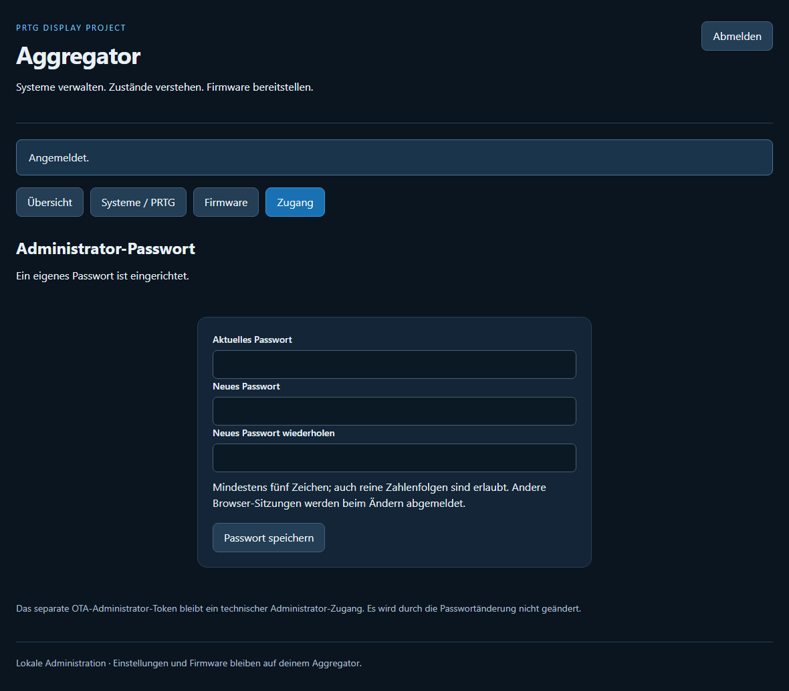
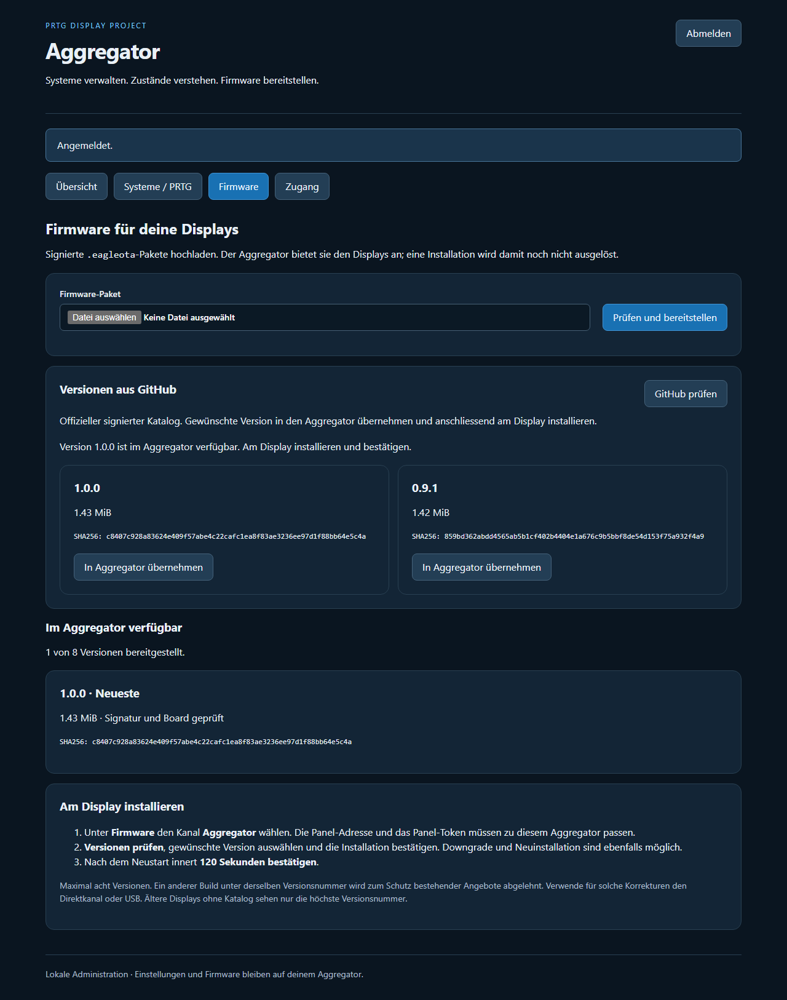

# Aggregator 1.1.0 – Bedienung

**Aggregator 1.1.0, zur Veröffentlichung freigegeben und in der Referenzinstallation produktiv installiert.** [Projektstand](../docs/PROJEKTSTATUS.md) · [Gesamthandbuch](../docs/HANDBUCH.md).

## Änderungen
- **Reihenfolge:** «Nach oben» / «Nach unten» im Systemformular, danach gemeinsam speichern. Die Übersicht verwendet die gespeicherte Reihenfolge. Das Display behält seine Bereiche; innerhalb eines Bereichs folgt die API der Systemreihenfolge.
- **System kopieren:** eigene eindeutige interne ID, Name mit «(Kopie)», Bereich, Aktivierung, Sensorschlüssel und sämtliche Kanaldefinitionen werden übernommen. PRTG-Sensor-IDs werden bewusst geleert, damit keine fremden Werte doppelt als eigenes System erscheinen. Eigene IDs eintragen und speichern. Kopie und Original sind unabhängig; Verwerfen entfernt ungespeicherte Kopien und Reihenfolgeänderungen.
- **Passwort:** bei der ersten Anmeldung das vorhandene OTA-Administrator-Token eingeben, dann unter **Zugang** ein Passwort setzen. Anschliessend genügt das Passwort. Mindestens fünf Zeichen, reine Zahlen erlaubt; höchstens 256 UTF-8-Bytes. Änderungen verlangen das aktuelle Passwort und eine Wiederholung des neuen Passworts im Formular. Es gibt keinen zusätzlichen Benutzernamen.
- **GitHub-Firmware:** unter Firmware **GitHub prüfen**, Version wählen, **In Aggregator übernehmen** bestätigen. Anschliessend am Display über den Kanal Aggregator installieren und bestätigen. Verfügbare Downgrades sind ebenso übernehmbar. Kein Fern-Flash und keine automatische Installation.

### Passwort, Sitzungen und Wiederherstellung

`admin/password.json` enthält ausschliesslich Schema, zufälliges Salt und scrypt-Hash; kein Klartextpasswort. Speicherung atomar mit Modus 0660 für Administrator-ACL-Vererbung. Verwaltungsordner samt Konfiguration und Passwortdatei geschützt sichern. Browser erhalten zufällige Sitzungstokens, die nur im Arbeitsspeicher bleiben. Serverseitig 15 Minuten ohne Anfragen, absolut maximal acht Stunden; die Oberfläche meldet zusätzlich nach 15 Minuten ohne Bedienung ab. Neustart, Abmeldung und Passwortwechsel widerrufen Sitzungen; bei Passwortwechsel bleibt nur die neue Sitzung aktiv. Maximal 32 Sitzungen. Fehlerhafte Logins werden begrenzt.

Das bestehende OTA-Administrator-Token bleibt für technische API-/Upload-Zugriffe gültig und muss weiterhin geheim bleiben. Die Browser-Anmeldung akzeptiert es nach dem Einrichten eines Passworts nicht mehr. Eine Passwortänderung rotiert dieses Token nicht und entzieht seinen Besitzern keine Administratorrechte.

Passwort vergessen: Container kontrolliert stoppen, ausschliesslich `admin/password.json` in einen geschützten Sicherungsordner ausserhalb von `admin/` verschieben, Container starten. Jetzt mit dem vorhandenen OTA-Administrator-Token anmelden und ein neues Passwort setzen. `settings.json`, PRTG-/Panel-Secrets und Firmware-Archiv behalten. Ein beschädigtes Passwortfile führt absichtlich zu einem Startfehler, nicht zu einer offenen Anmeldung.

### GitHub-Quelle und Prüfungen

Standard: `https://raw.githubusercontent.com/TroRon/PRTGDisplayProject/main/Display/ota/catalog.json`. Optional über `OTA_GITHUB_CATALOG` eine andere öffentliche GitHub-Raw-Katalogadresse setzen und Container neu erstellen. Nur HTTPS auf `raw.githubusercontent.com`, keine Zugangsdaten, Queryparameter oder Weiterleitungen. Es werden keine Administrator-/Panel-/PRTG-Zugangsdaten an GitHub gesendet. Der Vertrauensschlüssel bleibt der bestehende OTA-Schlüssel; ein anderes Repository muss damit signierte Pakete liefern.

Jeder Katalogeintrag wird vor der Anzeige auf Signatur, Board, Layout und Metadaten geprüft. Vor Übernahme erneut den Katalog abrufen; die Auswahl ist an den SHA256 gebunden. Download aus demselben Verzeichnis, begrenzte Antwortgrössen/Timeouts, Hash-/BIN-Descriptor-Prüfung vor Speicherung. Gleiche Version mit anderem Hash bleibt abgelehnt, maximal acht archivierte Versionen. Bereits importierte Angebote bleiben bei einem GitHub-Ausfall verfügbar.

Lokal getestet: 31 automatisierte Tests sowie Desktop-/Mobilbrowser mit Verschieben, Kopieren, Speicherung, Passwort-Einrichtung/Anmeldung und echtem signierten GitHub-Download in einen lokalen Demo-Aggregator. Produktives Deployment nach Freigabe separat geprüft; kein physischer Panel-OTA-Test dieser Erweiterung.

## Bilder: ausschliesslich synthetische Testumgebung

Die folgenden Browserbilder zeigen Aggregator 1.1.0 in einer lokalen Testumgebung. PBS Alpha/Beta, Sensor-ID 102 und Kanal Usage sind Testdaten. Passwortfelder sind leer; es sind keine echten Zugangsdaten, Live-Messwerte oder privaten Adressen enthalten. Die Firmwareversionen stammen aus dem öffentlichen signierten Katalog und sind keine Monitoring-Livedaten.

### Reihenfolge und Systemkopie

### Eigenes Administrator-Passwort

### Signierte GitHub-Angebote

