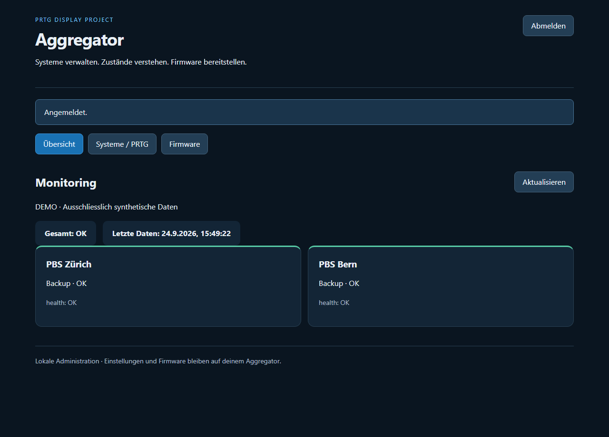
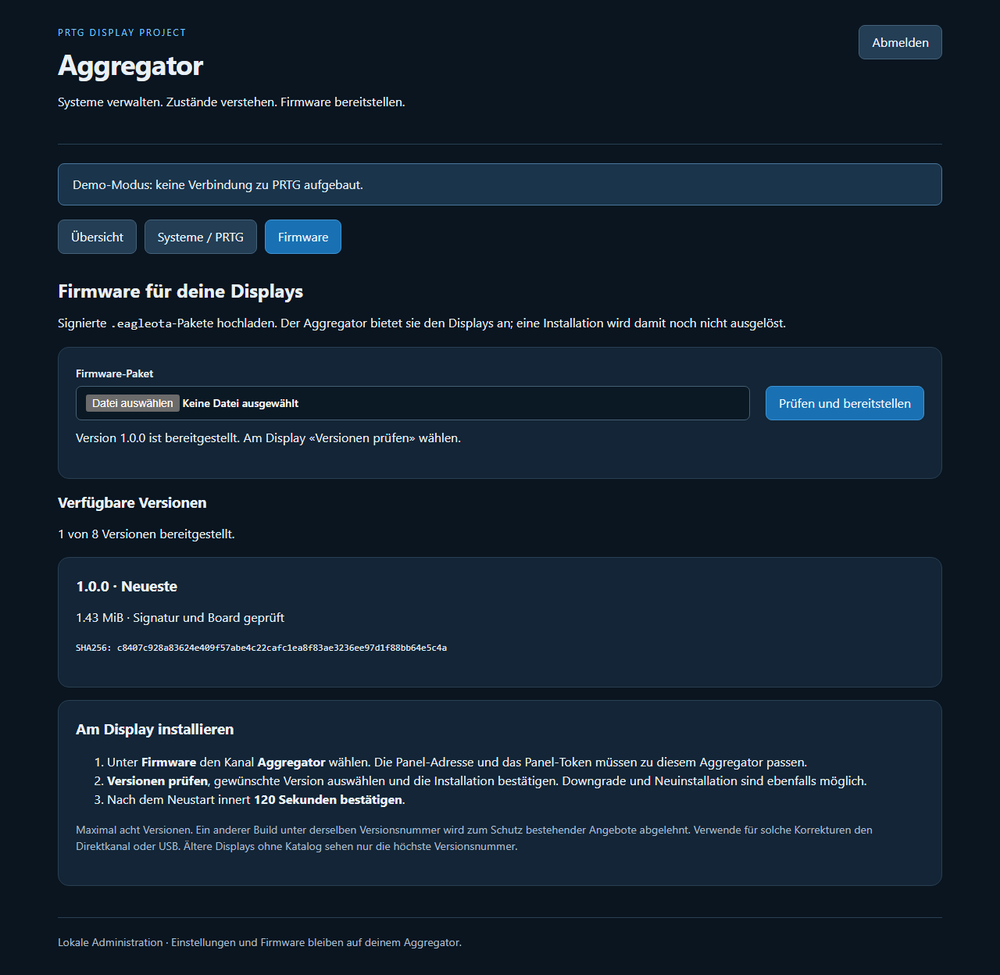

# Aggregator-WebAdmin und Firmware-Verwaltung

## Korrektur 1.2.1

Systemkarten der Übersicht sind rubrikübergreifend gleich hoch. Die Höhe richtet sich nach dem längsten Inhalt und passt sich bei neuen Daten sowie Bildschirmgrössenänderungen an. Desktop, Mobilansicht, lange Texte und Registerwechsel lokal geprüft. Keine neue Display-Firmware erforderlich.

## Aggregator 1.2.0 und Display 1.0.1

Systemverwaltung und Übersicht sind nach Infra, Backup, Docker, Netzwerk und Dienste gruppiert. Die Verwaltung zeigt aufklappbare Rubriken mit Anzahl aktiver Systeme. «System hinzufügen» übernimmt die Rubrik; «Nach oben/unten» verschiebt innerhalb dieser Rubrik. Deaktivierte Systeme bleiben ausgegraut und ausdrücklich markiert, damit sie wieder aktiviert werden können.

Änderungen gelten erst nach **Prüfen und speichern**. Die stets erreichbare Speicherleiste markiert offene Änderungen deutlich; «Verwerfen / neu laden» holt den gespeicherten Stand zurück. Die Übersicht zeigt nur gespeicherte aktive Systeme. Kategoriezuordnung und alle bisherigen Konfigurationswerte bleiben erhalten.

Display **1.0.1** übernimmt innerhalb seiner Rubriken die konfigurierte Reihenfolge. Die vorherige Firmware 1.0.0 R3 sortiert zusätzlich nach Status; für die korrekte Reihenfolge ist deshalb das Update erforderlich. Farben und Hinweise zeigen Fehler weiterhin. Deaktivierte Systeme verschwinden nach dem Speichern und dem nächsten gültigen API-Snapshot. Bei Verbindungsausfall können letzte Einträge als unbekannt sichtbar bleiben.

**Installation:** Aggregator aktualisieren; am Display unter Firmware die Versionen prüfen, **1.0.1 installieren** und nach dem Neustart innert **120 Sekunden bestätigen**. Direktkanal und Aggregator sind unterstützt. WLAN, Panel-Zugang und Einstellungen bleiben erhalten. Keine Partition-/Pinout-Änderung, kein Werksreset nötig.

Geprüft: 31 Aggregator-Tests, Desktop-/Mobilbrowser mit Gruppierung, Reihenfolge, Aktivierung, Speichern/Verwerfen und sichtbarer Speicherleiste; native LVGL- und Modelltests, beide PlatformIO-Profile, ESP-IDF-5.5.0-Hardware-Build und Paketprüfsummen. Physische Abnahme von Firmware 1.0.1 steht aus. Frühere Firmware-Releases bleiben unverändert.

**Aktuell: Aggregator 1.1.0.** [Sortieren/Kopieren, Passwort und GitHub-Import mit Bildern](VERSION-1.1.md) · [Betrieb / Backup](../docs/BETRIEB.md) · [Projektstatus](../docs/PROJEKTSTATUS.md). Display-Firmware 1.0.0 R3 bleibt unverändert.

## Was der WebAdmin bietet

- **Übersicht:** Gesamtzustand, letzter Datenstand und aktive Systeme. Demo ist ausdrücklich gekennzeichnet. Fehlende Daten bleiben unbekannt.
- **Systeme / PRTG:** PRTG-Adresse, API-Token, Abfragepause, Veraltungsgrenze, Timeout, Systemnamen, Kategorien, Aktivierung, Sensor-IDs und Kanalzuordnung.
- **Firmware:** Upload signierter `.eagleota`-Pakete, verfügbare Versionen, Grössen und Prüfsummen. Displays erhalten Katalog, Manifest und BIN über die vorhandene Panel-API.

Für «PBS Zürich» und «PBS Bern» zwei Systeme mit verschiedenen internen IDs und den jeweiligen PRTG-Sensor-IDs anlegen. Der **Anzeigename** wird auf allen Displays übernommen. Die interne ID eines vorhandenen Systems bleibt im Formular unverändert. PRTG-Kanalnamen müssen exakt passen. Eine leere Sensor-ID liefert unbekannt, kein künstliches Grün. Deaktivierte Systeme bleiben konfiguriert, werden aber weder abgefragt noch an das Display geliefert. Sind alle Systeme deaktiviert, bleibt der Gesamtzustand unbekannt.

**Prüfen und speichern** übernimmt das gesamte Formular. Ungültige Eingaben verändern den gespeicherten Stand nicht. Bei parallelen Änderungen durch einen anderen Browser muss der aktuelle Stand neu geladen werden; ungespeicherte Änderungen vorher notieren. Entfernen und Verwerfen verlangen eine Rückfrage. Gespeicherte Änderungen gelten ohne Container-Neustart. Neue Messwerte werden abgefragt; bis dahin ist der neue Zustand unbekannt. Eine bereits laufende alte Abfragerunde darf enden, ihre Ergebnisse werden nicht in den neuen Stand übernommen.

## Anmeldung

`https://monitor.example.org/admin` öffnen. Bei der ersten Einrichtung ohne Passwort das **separate OTA-Administrator-Token** eingeben, anschliessend unter **Zugang** ein eigenes Passwort setzen. Danach genügt dieses Passwort; kein Benutzername erforderlich. PRTG-/Panel-Token und Display-Passwort sind andere Zugänge.

Passwort mindestens fünf Zeichen, reine Zahlen erlaubt; Salt/scrypt-Hash in admin/password.json. Änderungen verlangen das aktuelle Passwort. Der Browser erhält ein zufälliges Sitzungstoken ausschliesslich im Arbeitsspeicher. Abmeldung/Neustart widerrufen Sitzungen; Passwortwechsel widerruft alle anderen Sitzungen. Nach 15 Minuten ohne Bedienung lokale Abmeldung; serverseitig 15 Minuten ohne Anfragen und maximal acht Stunden. Schliessen/Neuladen verlangt erneute Anmeldung.

Das ursprüngliche OTA-Administrator-Token bleibt ein technischer Vollzugang für APIs und Uploads. Eine Passwortänderung rotiert es nicht. Mindestens 32 Zeichen, getrennt vom Panel-Token. Nach Passwort-Einrichtung wird es nicht mehr als Browser-Login akzeptiert. Wiederherstellung ohne Passwort und Tokenrotation sind in der Betriebsanleitung beschrieben.

Der Server begrenzt falsche Anmeldeversuche je TCP-Absender auf zehn pro Minute. Hinter einem Proxy teilen sich Administratoren diesen Absender. Der öffentliche HTTPS-Ursprung muss exakt über `ADMIN_ORIGIN` konfiguriert sein, ohne abschliessenden Schrägstrich. HTTP ist nur für lokale Tests auf Loopback zulässig. Host und Origin müssen passen; untrusted Forwarding-Header gewähren keinen Zugriff. Der bestehende TCP-Absenderfilter bleibt bestehen.

PRTG-API-Tokens werden nur über ein verdecktes Eingabefeld ersetzt und niemals an den Browser zurückgegeben. Leer lassen erhält das bestehende Token. Bei Änderung der PRTG-Adresse ist ausdrücklich ein neues Token erforderlich, damit das alte nicht versehentlich an einen anderen Server geschickt wird. **Gespeicherte Verbindung prüfen** testet nur den bereits gespeicherten Stand; Demo stellt keine externe Verbindung her.

## Speicherung und bestehende Installationen

Die bisherigen Konfigurations- und Secret-Bind-Mounts bleiben **schreibgeschützt**. Der WebAdmin bekommt einen eigenen schreibbaren Ordner:

| Einstellung | Bedeutung |
|---|---|
| `ADMIN_DIRECTORY=/app/admin-store` | Persistenter Verwaltungsordner |
| `ADMIN_ORIGIN=https://monitor.example.org` | Exakte HTTPS-Adresse des Reverse-Proxys |
| `OTA_DIRECTORY=/app/firmware-store` | Persistentes Firmware-Archiv |
| `OTA_ADMIN_TOKEN_FILE=/run/secrets/ota_admin_token` | Separater Administrator-Zugang |

Ohne `ADMIN_DIRECTORY` bleibt der WebAdmin aus. Bisherige Installationen funktionieren weiterhin. Beim ersten Start werden die vorhandene Konfiguration und das bisherige PRTG-Token verwendet. Erst beim Speichern entsteht **`admin/settings.json`**. Diese Datei enthält die neue Konfiguration, eine Revision und gegebenenfalls das neu gesetzte PRTG-Token. Sie ist daher **geheim**, darf nicht in Git oder ungeschützte Backups gelangen und wird nicht per HTTP ausgeliefert.

Einmal gespeicherte Web-Einstellungen haben nach Neustarts Vorrang vor der ursprünglichen Konfigurationsdatei. Das PRTG-Secret aus dem schreibgeschützten Mount bleibt aktiv, bis es im WebAdmin ersetzt wird. Ein vorhandener, aber beschädigter Verwaltungsstand führt zu einem Startfehler; kein stiller Rückfall auf veraltete Daten. Zur kontrollierten Rückkehr zur ursprünglichen Konfiguration Container stoppen, `admin/settings.json` geschützt sichern und aus dem Verwaltungsordner entfernen, dann neu starten. Das entfernt keine Werte aus externen Backups.

Dateien werden über eine temporäre Datei im selben Ordner, Datei-Sync und atomare Umbenennung ersetzt. Bei einem Speicherfehler vor der Umbenennung bleibt der aktive Stand unverändert. Nur eine Instanz darf diesen Verwaltungsordner schreiben. Ein eigenes vollständiges Backup sollte `admin/`, ursprüngliche Konfiguration, Secrets und `firmware/` enthalten.

Container arbeitet weiterhin als UID/GID 1000, mit schreibgeschütztem Root-Dateisystem und ohne zusätzliche Capabilities. Der Server-Administrator benötigt Zugriff auf Daten und Stacks. Default-ACLs sind wichtig, damit auch neu vom Container erstellte Dateien für ihn lesbar und änderbar bleiben. Die Ordner sind keine öffentlichen Webverzeichnisse.

Panel-Token, Administrator-Token, Ports, Bind-Adressen, TCP-Allowlist und TLS-Zertifikate sind Installationsparameter. Sie werden bewusst über die geschützten Secret-Dateien bzw. Compose/Proxy verwaltet, nicht als Formularwerte zurückgegeben. Änderungen daran benötigen gegebenenfalls einen Container-Neustart und die passende Änderung an den Displays.

## Firmware bereitstellen

1. Zum Board passende signierte **`.eagleota`**-Datei aus dem Firmware-Release herunterladen. Kein ZIP, kein Full-Flash-Backup und keine einzelne unsignierte BIN hochladen.
2. Im WebAdmin **Firmware → Prüfen und bereitstellen** wählen. Signatur, Board, Layout, Versionsnummer, Grösse, SHA256 und Image-Deskriptor werden serverseitig geprüft.
3. Die Version erscheint in der Liste. Ein identisches Paket darf erneut hochgeladen werden und erzeugt kein Duplikat. Ein manipuliertes Paket wird abgelehnt.
4. Am Display **Firmware → Aggregator → Versionen prüfen** wählen. Die konfigurierte Panel-Adresse und das Panel-Token müssen zu diesem Aggregator passen. Gewünschte Version auswählen und Installation bestätigen. Es gibt keinen automatischen Installationsbefehl vom Server.
5. Nach dem Neustart innert **120 Sekunden** bestätigen. Ohne Bestätigung ist der bestehende Firmware-Rückfall vorgesehen; seine physische Abnahme ist separat erforderlich.

Der Katalog enthält maximal **acht verschiedene Versionen**, absteigend sortiert. Auch ältere signierte Versionen können hochgeladen und für Downgrades angeboten werden. Ältere Firmware ohne Katalog erhält weiterhin das höchste Angebot über `manifest.json`. Ein vorhandener alter Einzelpaket-Speicher wird bei einem neuen Upload ins Archiv übernommen. Die Download-Endpunkte bleiben mit dem Panel-Token geschützt. Der Upload erfordert das Administrator-Token.

**Andere Prüfsumme unter derselben Versionsnummer:** wird als `VERSION_CONFLICT` abgelehnt. Das gilt beispielsweise für 1.0.0 R2 versus R3, wenn das ältere Paket bereits im Aggregator liegt. Für diesen Sonderfall Direktkanal oder USB verwenden. Keine Signatur- oder Versionsschutzprüfung umgehen. Dieser Stand bietet keinen Löschen-/Ersetzen-Knopf für Firmware; bei acht belegten Plätzen das Archiv kontrolliert administrativ bereinigen und bestehende `current.eagleota`-/Katalog-Verweise berücksichtigen. Die Oberfläche nennt den Grund, statt einen erfolgreichen Upload vorzutäuschen.

Die bisherige Seite `/updates` bleibt kompatibel; der neue WebAdmin bietet dieselbe geprüfte Bereitstellung plus Versionsübersicht. API-Pfade für Displays: `/api/v1/firmware/catalog.json`, `/api/v1/firmware/manifest.json` und `/api/v1/firmware/<SHA256>.bin`.

## Installation

1. `.env.example` nach `.env` kopieren. Einen absoluten `DATA_DIRECTORY` und `ADMIN_ORIGIN=https://monitor.example.org` mit deiner eigenen HTTPS-Adresse setzen.
2. `sudo bash prepare-storage.sh /dein/datenordner DEIN_ADMIN_BENUTZER` ausführen. Vorhandene Konfigurationen und Tokens werden nicht ersetzt. Das PRTG-Token kann leer bleiben, um es anschliessend im WebAdmin einzutragen.
3. `docker compose config --quiet` prüfen, danach `docker compose up -d --build`. Bestehende externe Mounts und Netzgrenzen beim Upgrade erhalten. Vorher Daten und Secrets sichern.
4. Den Reverse-Proxy auf den Backend-Port zeigen lassen und HTTPS einrichten. Host weitergeben. `/admin`, `/admin.js`, `/admin.css`, `/api/admin/*`, `/updates`, `/updates.js` und `/api/v1/firmware/*` freigeben. Uploads benötigen rund 4 MiB plus 8196 Byte und bis zu zwei Minuten.
5. `/admin` öffnen, mit dem lokalen `secrets/ota_admin_token.txt` anmelden und PRTG sowie Systeme konfigurieren. Token nur lokal übernehmen, niemals im Chat oder in Git teilen. Rechte auf neu erstellte `admin/settings.json` als Server-Administrator prüfen.

## Lokale Prüfung und Grenzen

Automatische Tests decken Validierung, deaktivierte Systeme, Konflikte paralleler Speicherung, Persistenz/Neustart, Speicherfehler, beschädigte Verwaltungsdateien, Origin-/Host-/Token-Abgrenzung, Rate-Limit, Geheimnis-Ausschluss, laufende alte Abfragen sowie signierten Upload bis zum authentifizierten BIN-Download ab. Die bestehende Aggregator-Suite bleibt enthalten.

Browserprüfung am **echten lokalen Demo-Server** mit synthetischen Daten: Anmeldung, zwei PBS-Systeme, Umbenennen, Deaktivieren, Hinzufügen, Eingabefehler, Verwerfen, sicher dargestellter HTML-Testname, Verbindungsprüfung, echter signierter R3-Upload, Abmeldung sowie Desktop und 390-Pixel-Mobilansicht. Keine produktive PRTG-Verbindung, kein Docker-Build/Live-Deployment und kein realer Panel-OTA-Test dadurch bestätigt.

## Vorschau mit synthetischen Daten

