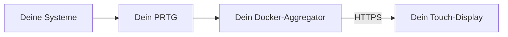
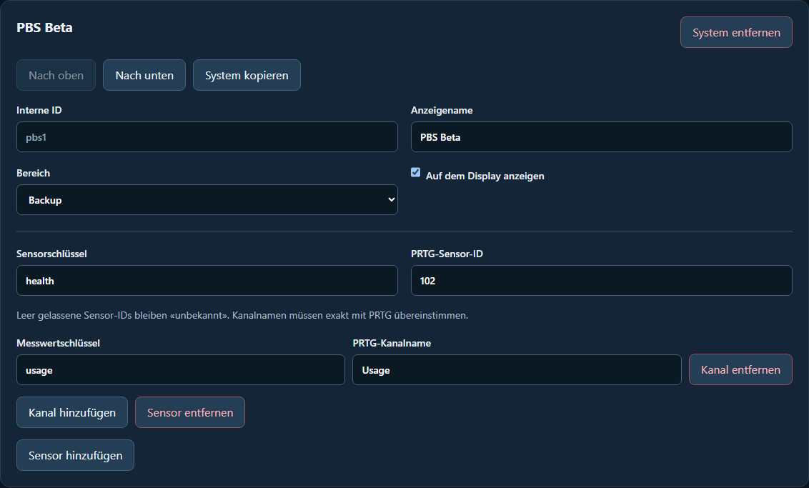

# PRTG Display Project

## Firmware 1.0.3 – Favoriten und Messwertverläufe

- Favoriten für ausgewählte Systeme und automatische Ansicht bei neuen kritischen Störungen.
- Optionale Messwertverläufe mit maximal 16 echten Messpunkten je System, ausschliesslich im PSRAM.
- Hinweis auf 2,4-GHz-WLAN bei der Einrichtung.

Neue Komfortfunktionen sind standardmässig ausgeschaltet. Aktivierung unter Einstellungen → Panel → Anzeige. Keine zusätzlichen PRTG-Abfragen und keine periodische Verlaufssicherung im Flash.

Update per OTA: Versionen prüfen → 1.0.3 installieren → nach dem Neustart innert 120 Sekunden bestätigen. WLAN und Panel-Konfiguration bleiben erhalten. 1.0.2 bleibt als Rückweg verfügbar.

Waveshare ESP32-S3-Touch-LCD-5B, SKU 28151; ESP-IDF 5.5.0. Hardware-Build, beide PlatformIO-Profile und lokale Modell-/LVGL-/Einstellungstests erfolgreich. Signaturen, Paket- und Quellprüfsummen geprüft. Physische Geräteabnahme von 1.0.3 steht noch aus.

## Firmware 1.0.2 – schlanke Anzeige-Erweiterung

- Einheitlich hohe Systemkarten mit vollständigem Text.
- Datenalter je System aus den PRTG-Messzeitstempeln.
- Optionaler Seitenwechsel mit Touch-/Einstellungs-/OTA-Pause.
- Optionaler softwareseitiger Nachtmodus mit Helligkeit, Stunden und manuellem UTC-Versatz.

Einrichten unter **Einstellungen → Panel → Anzeige**. Beide Automatiken sind zunächst ausgeschaltet. Favoriten, automatische Störungswechsel und Verlaufsgrafiken wurden bewusst zurückgestellt; ihre Speicher-/Hintergrundlogik ist nicht im Release enthalten.

**Update:** Versionen prüfen, **1.0.2 installieren**, nach dem Neustart innert **120 Sekunden bestätigen**. Direktkanal und Aggregator werden unterstützt. WLAN/Panel-Zugang bleiben erhalten; kein Werksreset nötig. Board Waveshare ESP32-S3-Touch-LCD-5B SKU 28151, ESP-IDF 5.5.0, bestehendes OTA-Layout unverändert. Frühere Pakete bleiben erhalten.

Modell-/LVGL-/Einstellungsprüfungen, beide PlatformIO-Profile und Hardware-Build lokal erfolgreich. Paket-Hashes und Signatur geprüft. Physischer Geräte-/Dauerlauftest von 1.0.2 steht aus.

## Aggregator 1.2.0 und Display 1.0.1

Systemverwaltung und Übersicht sind nach Infra, Backup, Docker, Netzwerk und Dienste gruppiert. Die Verwaltung zeigt aufklappbare Rubriken mit Anzahl aktiver Systeme. «System hinzufügen» übernimmt die Rubrik; «Nach oben/unten» verschiebt innerhalb dieser Rubrik. Deaktivierte Systeme bleiben ausgegraut und ausdrücklich markiert, damit sie wieder aktiviert werden können.

Änderungen gelten erst nach **Prüfen und speichern**. Die stets erreichbare Speicherleiste markiert offene Änderungen deutlich; «Verwerfen / neu laden» holt den gespeicherten Stand zurück. Die Übersicht zeigt nur gespeicherte aktive Systeme. Kategoriezuordnung und alle bisherigen Konfigurationswerte bleiben erhalten.

Display **1.0.1** übernimmt innerhalb seiner Rubriken die konfigurierte Reihenfolge. Die vorherige Firmware 1.0.0 R3 sortiert zusätzlich nach Status; für die korrekte Reihenfolge ist deshalb das Update erforderlich. Farben und Hinweise zeigen Fehler weiterhin. Deaktivierte Systeme verschwinden nach dem Speichern und dem nächsten gültigen API-Snapshot. Bei Verbindungsausfall können letzte Einträge als unbekannt sichtbar bleiben.

**Installation:** Aggregator aktualisieren; am Display unter Firmware die Versionen prüfen, **1.0.1 installieren** und nach dem Neustart innert **120 Sekunden bestätigen**. Direktkanal und Aggregator sind unterstützt. WLAN, Panel-Zugang und Einstellungen bleiben erhalten. Keine Partition-/Pinout-Änderung, kein Werksreset nötig.

Geprüft: 31 Aggregator-Tests, Desktop-/Mobilbrowser mit Gruppierung, Reihenfolge, Aktivierung, Speichern/Verwerfen und sichtbarer Speicherleiste; native LVGL- und Modelltests, beide PlatformIO-Profile, ESP-IDF-5.5.0-Hardware-Build und Paketprüfsummen. Physische Abnahme von Firmware 1.0.1 steht aus. Frühere Firmware-Releases bleiben unverändert.

**[Gesamtes Projekthandbuch](docs/HANDBUCH.md)** · [Bedienung, Updates und Fehlerhilfe](docs/BETRIEB.md) · [Architektur / Entwicklung](docs/ENTWICKLUNG.md) · [Projektstand und offene Punkte](docs/PROJEKTSTATUS.md)

**Versionshinweis:** Aggregator **1.1.0** mit Sortieren/Kopieren, Passwort und GitHub-Import ist zur Veröffentlichung freigegeben. Display **1.0.0 R3** bleibt unverändert. Ein Git-Push aktualisiert fremde Installationen nicht; den Aggregator gezielt neu bauen/starten.

## Aggregator 1.1.0 – WebAdmin

Systemnamen, Kategorien, Sensoren und PRTG-Verbindung im Browser konfigurieren. Signierte Firmware-Pakete hochladen und am Display über den Aggregator auswählen. Eigenständiger Administrator-Zugang und persistente Einstellungen. [Einrichtung und Bedienung](DockerAggregator/WEBADMIN.md). Display-Firmware 1.0.0 R3 unverändert.

**Dein Monitoring. Dein Netzwerk. Ein eigenes Touch-Display.**

PRTG Display Project bringt bestehende PRTG-Messwerte auf ein eigenständiges 5-Zoll-Panel. PRTG überwacht die Systeme, ein kleiner Docker-Dienst bereitet die Daten auf, das Display zeigt ihren Zustand und Details per Touch.

Es gibt keine vorgegebene Serverliste und keine Verbindung zur Infrastruktur des Entwicklers. Du trägst deine eigenen Adressen, Sensor-IDs, Namen und Zugangsdaten ein.



## Drei Bausteine, eine Anleitung

| Bereich | Inhalt | Einstieg |
|---|---|---|
| **PRTG Sensoren** | Konfigurierbare Sensor-Vorlagen, Kanäle und Rechte | [Sensoren einrichten](PRTG%20Sensoren/README.md) |
| **DockerAggregator** | PRTG-Abfragen, Health-API und Firmware-Bereitstellung | [Aggregator installieren](DockerAggregator/README.md) |
| **Display** | Firmware, USB-Einrichtung, Oberfläche und OTA | [Display in Betrieb nehmen](Display/README.md) |

## Was das Display zeigt

- Systemkarten mit frei vergebenen Namen, Status und Messwerten.
- Bereiche **Infra**, **Backup**, **Docker**, **Netzwerk** und **Dienste**. Ab Firmware 0.8.1 werden nicht konfigurierte Bereiche ausgeblendet; aktive Bereiche mit fehlenden Daten oder Fehlern bleiben sichtbar.
- Echte Fehler, fehlende Daten und veraltete Werte werden unterschieden. Ein Verbindungsfehler wird nicht als grüner Zustand dargestellt.
- Eine ausdrücklich gekennzeichnete Demo mit fiktiven Daten für Vorführungen bei vollständigem Ausfall.
- Einstellungen für Verbindung, Panel, Systeminformationen, Projektinformationen und Firmware-Updates.

**Der Zustand kommt aus PRTG.** Schwellwerte und Alarmierung werden dort gepflegt. Der Aggregator führt keine konkurrierende Docker-Einzelüberwachung durch.

## Was du brauchst

- Eine erreichbare PRTG-Installation mit den gewünschten Sensoren und einem Benutzer mit Leserechten.
- Einen Docker-Host mit Docker Compose; Dockge kann die Compose-Datei ebenfalls verwalten.
- Einen HTTPS-Zugang zum Aggregator mit einem vom Panel vertrauenswürdigen Zertifikat, DNS und erreichbarem NTP.
- **Waveshare ESP32-S3-Touch-LCD-5B, SKU 28151:** 1024 × 600, 16 MB Flash, 8 MB Octal-PSRAM, kapazitiver Touch.
- 2,4-GHz-WLAN, Stromversorgung und für die erste Installation ein USB-Datenkabel.

Die Firmware ist für dieses konkrete Board bestimmt. Ähnlich benannte Displays können andere Anschlüsse, Auflösungen und Treiber benötigen.

## Vom leeren System zur Live-Anzeige

1. **Sensoren bereitstellen.** Vorhandene PRTG-Sensoren verwenden oder die Vorlagen anpassen. Erst in PRTG kontrollieren, ob Werte und Zustände stimmen.
2. **Lesenden API-Zugang anlegen.** Dem Benutzer Zugriff auf die benötigten Geräte/Sensoren erteilen. Für die aktuelle Zeitinterpretation den API-Benutzer auf UTC einstellen und Sensorzeiten prüfen.
3. **Aggregator konfigurieren.** Beispielkonfiguration kopieren; eigene PRTG-Adresse, Sensor-IDs, Anzeigenamen, Kategorien und Kanalnamen eintragen. API-Token ausschliesslich lokal speichern.
4. **Docker und HTTPS starten.** Health-API mit dem eigenen Panel-Token prüfen. Der PRTG-Key bleibt auf dem Server.
5. **Display flashen.** Das vollständige USB-Paket verwenden; danach WLAN, Panel-Token und NTP eingeben.
6. **Panel einrichten.** Unter «Panel» die eigene Aggregator-Adresse und den gewünschten Titel eintragen, beispielsweise «Serverraum» oder «Mein Monitoring».
7. **Live-Zustand prüfen.** WLAN, Zeit, API-Erreichbarkeit und PRTG-Datenvollständigkeit kontrollieren. Eine sichtbare Demo ist kein erfolgreicher Live-Test.

Die drei Bereichsanleitungen enthalten die konkreten Befehle, Beispiele und Fehlerhilfen. Alle Beispieladressen und Systemnamen sind Platzhalter.

## Was konfigurierbar ist

| Einstellung | Ort |
|---|---|
| Überwachte Systeme, Sensoren, Grenzwerte | PRTG |
| PRTG-Adresse, Sensor-IDs, Systemnamen, Kategorien, Kanäle | Aggregator-Konfiguration |
| Abfragepause, Datenalter und Request-Timeout des Aggregators | Aggregator-Konfiguration |
| Datenverzeichnis, Host-Bindung und Port | Docker Compose / lokale `.env` |
| PRTG-, Panel- und OTA-Administrator-Token | Lokale Secret-Dateien |
| WLAN, Panel-Token und NTP | Display oder USB-Einrichtung |
| Aggregator-HTTPS-Adresse und Panel-Anzeigename | Display → Panel oder USB-Assistent, optional `--panel-only` |
| OTA-Kanal und öffentliche Manifest-Adresse | Display → Firmware oder USB-Assistent, optional `--ota-only` |

Die Hardwarebelegung, API-Version und Kategorien-Schlüssel sind technische Vorgaben. Aktuell unterstützt das Display bis zu **24 Systeme**, Antworten bis **32 KiB** und die oben genannten fünf Kategorien. Die Panel-Abfragepause beträgt 15 Sekunden, der Demo-Fallback 50 Sekunden; diese beiden Werte sind derzeit Build-Einstellungen. Eigene private Zertifizierungsstellen brauchen eine angepasste Vertrauenskonfiguration im Build. «Konfigurierbar» bedeutet nicht, dass beliebige Boards oder unbekannte API-Formate automatisch unterstützt werden.

## Updates ohne USB

Nach der einmaligen OTA-fähigen USB-Installation kannst du zwischen zwei Wegen wählen:

1. **Dein Aggregator:** Ein signiertes Paket auf der internen Upload-Seite bereitstellen und am Display installieren.
2. **Öffentliches Firmware-Repo:** Das Display lädt das signierte Angebot direkt per HTTPS. Weder GitHub-Anmeldung noch GitHub-Token sind erforderlich.

Die Manifest-Adresse dieses Repos lautet:

```text
https://raw.githubusercontent.com/TroRon/PRTGDisplayProject/main/Display/ota/manifest.json
```

Das Manifest bietet 1.0.0 Revision 3 an; der öffentliche OTA-Katalog enthält 1.0.0 und 0.9.1. Frühere entfernte Versionen bleiben entfernt. Ab 0.8.0 zeigt «Versionen prüfen» einen Katalog mit Update, Downgrade und Neuinstallation. Ältere Firmware erhält weiterhin das neueste Angebot. Signatur, Board, Version und Prüfsumme werden vor Aktivierung geprüft. Nach einem OTA-Neustart muss die neue Version innerhalb von 120 Sekunden am Display bestätigt werden; sonst ist ein Rückfall vorgesehen. [Details zu Flashen und OTA](Display/README.md).

## Datenschutz und Zugangsdaten

Dieses Repo enthält ausschliesslich allgemeine Vorlagen, Quellcode und bewusst erzeugte Release-Dateien. Es enthält keine produktiven Inventare, internen Adressen oder provisionierten Flash-Backups. Auch eigene `.env`, `data/`, Secret-Dateien und private Signierschlüssel gehören niemals in Git.

Das Display spricht bei Live-Daten mit **deinem Aggregator**; PRTG-Zugangsdaten werden nicht auf das Panel übertragen. Der öffentliche OTA-Kanal wird nur verwendet, wenn du ihn auswählst und die Update-Prüfung startest. Die Demo ist lokal und benötigt keine Cloud.

## Projektstand und Mitwirkung

**Aktuell 1.0.0 Revision 3:** WLAN-QR-Code und Captive Portal vereinfachen die Ersteinrichtung. Automatischer Setup-Hotspot und WebAdmin-Passwörter ab fünf Byte. Werksreset mit Rückfrage, Register Info und Demo erst nach 50 Sekunden. WLAN-Auswahl, Einrichtungshotspot **SetupPRTGDisplay** und passwortgeschützter WebAdmin für Einstellungen und OTA. [Einrichtung](Display/SETUP.md) · [Änderungen und Upgrade](CHANGELOG.md) · [USB-Paket](Display/releases/prtg-display-1.0.0.zip).

Bei fehlendem WebAdmin-Zugang wird automatisch ein zwölfstelliges Zahlenpasswort erzeugt und unter Webzugang angezeigt. Bestehende eigene Passwörter bleiben erhalten. HTTP ist für das vertrauenswürdige lokale Netz vorgesehen. Alle Zugangsdaten und die Aggregator-Adresse richtet der Benutzer selbst ein.

1.0.0 Revision 3 ist lokal gebaut und getestet; die Abnahme der neuen Funktionen am echten Gerät steht noch aus. 0.8.1 wurde vom Betreiber mit Live-Anzeige, OTA-Installation und ausgeblendeten inaktiven Rubriken bestätigt. Ein gezielter Rollback-Test steht weiterhin aus.

Idee und Projektleitung: **Ronny Troxler**. Entwicklung mit Unterstützung von OpenAI Codex. Technische Grundlagen: Espressif ESP-IDF, Waveshare, LVGL und ArduinoJson. PRTG ist ein Produkt von Paessler; dieses Projekt ist kein offizielles Paessler-Produkt.

Die Lizenz für den eigenen Projektcode ist noch festzulegen. Öffentlich sichtbarer Code allein ist keine pauschale Lizenzfreigabe. Die mitgelieferten [Drittanbieter-Lizenzen](Display/LICENSES/) gelten unverändert.

## Lokal prüfen

```text
cd DockerAggregator
node --test
cd ..
python tools/test_sensor.py
python tools/check-public.py
```

Der Veröffentlichungscheck prüft Release-Hashes, typische Schlüssel-/Tokenmuster, persönliche Buildpfade und ZIP-Inhalte. Er ersetzt nicht die manuelle Prüfung von Inventaren, Adressen und allen zu veröffentlichenden Dateien. Docker-Build, Live-Sensoren und reale Hardware separat abnehmen.

## Entwicklung und Veröffentlichungen

Die Trennung von Entwicklung und Distribution sowie die verpflichtende Benutzerfreigabe sind in [WORKFLOW.md](WORKFLOW.md) beschrieben. Version 0.8.1 wurde vom Betreiber auf dem realen Display erfolgreich bestätigt, einschliesslich OTA und ausgeblendeter inaktiver Rubriken. Eine gezielte Rollback-Abnahme steht weiterhin aus.

Bereits installierte 1.0.0 wird über **Versionen prüfen → 1.0.0 → Neuinstallation** aktualisiert. Danach innerhalb von 120 Sekunden bestätigen. [Korrekturstand und Installationshinweise](CHANGELOG.md).

## Aggregator 1.1.0 mit synthetischen Daten

Browseransicht von Aggregator 1.1.0 mit ausschliesslich synthetischem System und Test-Sensor-ID, keine Live-Daten.


