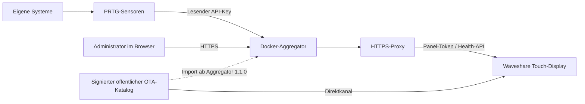

# Projekthandbuch – von PRTG zum Display

Dieses Handbuch führt durch das gesamte Projekt. Beispielnamen wie **PBS Alpha**, Adressen unter **example.org** und die gezeigten Messwerte sind synthetisch. Keine produktiven Inventare oder Zugangsdaten übernehmen. Vor Beginn [Versionsstand und Grenzen](PROJEKTSTATUS.md) lesen.

## 1. Aufgabe und Aufbau

Das Projekt zeigt vorhandenes PRTG-Monitoring auf einem eigenständigen Touch-Display. PRTG bleibt die Quelle der Messwerte und Alarmschwellwerte. Der Aggregator liest nur freigegebene Sensoren, verarbeitet deren Alter und Status und liefert einen kompakten Snapshot. Das Display benötigt keinen direkten PRTG-, Proxmox-, PBS- oder SSH-Zugang.



Die Ordner **PRTG Sensoren**, **DockerAggregator** und **Display** bilden diese drei Teile ab. Der Display-WebAdmin und der Aggregator-WebAdmin sind zwei getrennte Anwendungen mit getrennten Zugangsdaten.

## 2. Voraussetzungen und Planung

- Waveshare ESP32-S3-Touch-LCD-5B, SKU 28151: 5 Zoll, 1024 × 600, kapazitiver Touch, 16 MB Flash, 8 MB Octal-PSRAM. Andere Boards nicht mit diesem Paket flashen.
- USB-Datenkabel und stabile Stromversorgung; Windows, macOS oder Linux mit Python 3 für den Flash-Assistenten.
- 2,4-GHz-WLAN. Gewünschtes WLAN und Netzfreigaben vorab planen.
- Docker-Host mit Docker Compose, optional Dockge. Setup benötigt unter anderem `openssl`, `acl`/`setfacl`, `realpath`, `runuser` und `setpriv`.
- PRTG mit aktuellen Sensoren, lesender API-Identität und UTC-Zeitzone für diese Identität.
- Ein eigener DNS-Name wie `monitor.example.org`, gültiges HTTPS-Zertifikat und Reverse Proxy. DNS/NTP müssen aus dem Display-Netz erreichbar sein.

Benötigte Verbindungen: Aggregator → PRTG per HTTPS; Display → Aggregator per HTTPS sowie DNS/NTP; Administrator → Aggregator und zur Einrichtung ins Display-Netz. Der Direktkanal benötigt vom Display HTTPS-Zugriff zu GitHub. Ab 1.1.0 benötigt der GitHub-Import diesen Zugriff vom Aggregator. Der Einrichtungshotspot bietet keinen Internetzugang.

## 3. PRTG vorbereiten

1. Sensoren zunächst in PRTG zum Funktionieren bringen. Werte, Messintervall und Status prüfen.
2. Für jeden gewünschten Sensor **Objekt-ID** und exakte Kanalnamen notieren. Ein Gerätename ersetzt keine Sensor-ID.
3. Eine Benutzergruppe ohne Administratorrechte und einen zugeordneten API-Benutzer anlegen.
4. **Am Gerät oder der übergeordneten Gruppe** unter Zugriffsrechte Lesezugriff vergeben. Vererbung bis zu den Sensoren prüfen; Rechte anderer Gruppen erhalten.
5. Mit diesem Benutzer kontrollieren, dass die vorgesehenen Sensoren sichtbar sind. UTC-Zeitzone einstellen, API-Key lokal erstellen.
6. Warn-/Fehlerschwellwerte in PRTG passend zum überwachten System pflegen. Fehlende Werte dürfen kein künstliches Grün erzeugen.

[Sensor-Vorlagen und Parameter](../PRTG%20Sensoren/README.md) erläutern Proxmox/PBS auf einer Windows-Probe und Docker per Linux/SSH-Sensor. Vorhandene Sensoren können genauso verwendet werden. Die Beispiele müssen für die eigene Probe, API-Rechte und Zertifikatskette getestet werden.

## 4. Aggregator installieren

Im Ordner `DockerAggregator` beginnen:

```sh
cp .env.example .env
sudo bash prepare-storage.sh ./data DEIN_ADMIN_BENUTZER
```

`DEIN_ADMIN_BENUTZER` durch einen existierenden Linux-Administrator ersetzen. Bei einem absoluten Datenverzeichnis denselben Pfad im Script und in `.env` verwenden. Der Helper erzeugt getrennte Panel-/OTA-Tokens, erhält vorhandene Secrets und setzt Rechte auch für neue Dateien. Den PRTG-Key verdeckt eingeben oder später im WebAdmin eintragen; dafür muss die angelegte Secret-Datei existieren.

In `.env` mindestens `ADMIN_ORIGIN=https://monitor.example.org` setzen. `DATA_DIRECTORY`, `BIND_ADDRESS`, `PORT` und `COMPOSE_PROJECT_NAME` anpassen. Keine PRTG-/Panel-Secrets in Compose eintragen. Die Standardbindung ist Loopback; ein Proxy auf einem anderen Host braucht eine gezielt erreichbare Bind-Adresse und passende Netzbeschränkung.

```sh
docker compose config --quiet
docker compose up -d --build
docker compose ps
docker compose logs --tail=40 aggregator
```

**Dockge:** dieselben Dateien als Stack verwenden. Build-Kontext, `.env` und Compose gehören ins Stack-Verzeichnis; persistente Daten separat ablegen. Absolute Bind-Pfade erleichtern die Zuordnung. Nicht versehentlich einen zweiten Stack mit denselben Daten starten.

`healthy` bestätigt den Prozess, noch keine aktuellen PRTG-Daten. Read-only-Root, Benutzer `node`, entfernte Capabilities und geschützte Secret-Mounts beibehalten. Nur Verwaltungs- und Firmware-Ordner sind beschreibbar. [Vollständige Compose-/Proxy-Anleitung](../DockerAggregator/README.md).

## 5. DNS und HTTPS

DNS muss `monitor.example.org` auf den eigenen Reverse Proxy auflösen. Dieser leitet den gesamten Host an den Aggregator weiter, auch `/admin`, `/api/admin/` und `/api/v1/firmware/`. Host-Header erhalten. `ADMIN_ORIGIN` muss exakt zur Browseradresse passen, ohne Pfad oder abschliessenden Schrägstrich.

Auf einem Proxy am selben Host kann beispielsweise `reverse_proxy 127.0.0.1:8787` verwendet werden. Bei getrennten Containern/Hosts ist Loopback nicht automatisch der Aggregator. Eigene Domain, Zertifikat und Zieladresse konfigurieren. Private CAs erfordern Vertrauen in Node und im Display; nicht die Zertifikatsprüfung abschalten.

Prüfung: WebAdmin ohne Zertifikatswarnung öffnen; Panel später ebenfalls mit korrekter Zeit verbinden. Backend nur aus benötigten Netzen erreichbar machen. Details und optionale TCP-Absenderliste stehen in der Aggregator-Anleitung.

## 6. Systeme im WebAdmin einrichten

`https://monitor.example.org/admin` öffnen. **Aggregator 1.0.0:** Anmeldung mit dem separaten OTA-Administrator-Token. **Aggregator 1.1.0:** beim ersten Mal ebenfalls dieses Token, danach unter Zugang eigenes Passwort setzen. Das Display-Passwort gilt hier nicht.

Unter **Systeme / PRTG** PRTG-Ursprung, API-Key und Abfrageparameter eintragen. Beim Wechsel der PRTG-Adresse ist ein neuer Key nötig. Für jedes System eine eindeutige interne ID, einen Anzeigenamen, Bereich und Sensoren erfassen. Sensorschlüssel und Messwertschlüssel sind technische Bezeichner; Kanalnamen müssen exakt PRTG entsprechen. Beispiel: zwei PBS-Systeme erhalten eigene IDs, Namen und Sensor-IDs.

**Prüfen und speichern** übernimmt alles gemeinsam. Neue Werte werden abgefragt; bis dahin ist unbekannt korrekt. **Gespeicherte Verbindung prüfen** testet den gespeicherten API-Zugang, nicht ungespeicherte Formularwerte. Deaktivierte Systeme bleiben gespeichert und verschwinden aus der Live-Anzeige. Nach dem ersten Web-Speichern hat `admin/settings.json` Vorrang vor der ursprünglichen JSON-Datei.

Ab Aggregator 1.1.0: Reihenfolge ändern, Systeme samt Definitionen kopieren und eigene Passwörter verwalten. [Schrittweise Bedienung und Vorschaubilder](../DockerAggregator/VERSION-1.1.md).

## 7. Firmware per USB installieren

Das vollständige [USB-Paket 1.0.0 R3](../Display/releases/prtg-display-1.0.0.zip) entpacken. Vier getrennte Images, kein Backup eines eingerichteten Geräts. Die Firmwareversion bleibt 1.0.0; R3 bezeichnet die Paketrevision. **Simulator 0.3 ist keine Hardware-Firmware.**

[Display-Anleitung](../Display/README.md) enthält die Python-Umgebung für Windows/macOS/Linux. Im entpackten Paket zuerst `flash.py --check`, danach `flash.py` mit dem dort dokumentierten Python starten. Port auswählen, Zielgerät prüfen und erst mit `FLASH` bestätigen. Schreiben/Verifizieren abwarten, USB nicht trennen. Offsets ausschliesslich aus der [paketeigenen FLASH.md](../Display/releases/1.0.0/FLASH.md) übernehmen.

Der Assistent bietet anschliessend die vollständige Parametereinrichtung oder gezielt nur Panel, OTA oder WebAdmin an. WLAN-Zugang, Panel-Token, NTP, Aggregator-Ursprung und Displayname können so über USB eingegeben werden. Bereits gesetzte Daten bleiben bei normalen USB-/OTA-Updates grundsätzlich erhalten; Werksreset und vollständiges Löschen sind separate Aktionen.

## 8. Ersteinrichtung am Display oder Handy

1. Ohne gespeicherte WLAN-Konfiguration startet **SetupPRTGDisplay** automatisch; nach Werksreset ebenso.
2. Setup-QR-Code mit dem Handy scannen oder SSID und angezeigtes Hotspot-Passwort manuell verwenden. Das Handy soll im WLAN ohne Internet bleiben.
3. Die Anmeldeseite kann automatisch öffnen. Falls nicht: `http://192.168.4.1` im Browser öffnen.
4. Benutzer **admin**, eigenes Display-WebAdmin-Passwort bzw. angezeigtes initiales zwölfstelliges Zahlenpasswort verwenden. Es ist unabhängig vom Hotspot-Passwort.
5. Eigenen Panelnamen und Aggregator-Ursprung setzen; WLAN auswählen und Passwort sowie Panel-Token eintragen. Der PRTG-Key gehört nicht aufs Display.
6. Nach erfolgreicher WLAN-Verbindung endet der Hotspot. Handy ins normale Netz zurückbringen und bei Bedarf `http://<Display-IP>` öffnen. Hotspot endet auch nach etwa zehn Minuten.

Alternativ WLAN direkt am Display suchen und auswählen; versteckte SSID manuell erfassen. Unterstützte WLAN-Verfahren, Passwortregeln, Webzugang und Reset sind in [SETUP.md](../Display/SETUP.md) beschrieben. Die Handy-Abnahme des R3-Setups ist noch offen.

## 9. Abnahme: wirklich Live?

- Display hat IP, synchronisierte Zeit und HTTP-Erfolg vom Aggregator.
- Angezeigter Modus ist **Live**; fehlende Kategorien sind bewusst nicht eingerichtet.
- Systemnamen stimmen, Sensorzeiten sind aktuell und Messwerte passen zu PRTG.
- Ein echter PRTG-Warn-/Fehlerzustand wird übernommen; «unknown» ist kein erfolgreicher Test.
- Nach Neustart bleiben Einstellungen erhalten. Keine Secrets in Fotos/Logs dokumentieren.
- Bei vollständigem Verbindungs-/Quellenausfall folgt ab 1.0.0 nach 50 Sekunden eine deutlich markierte Demo; nach Erholung wieder Live. Teilfehler werden weiter als echte Teilfehler angezeigt.

[Weiter: Bedienung, Updates, Backup und Fehlerbehebung](BETRIEB.md).
